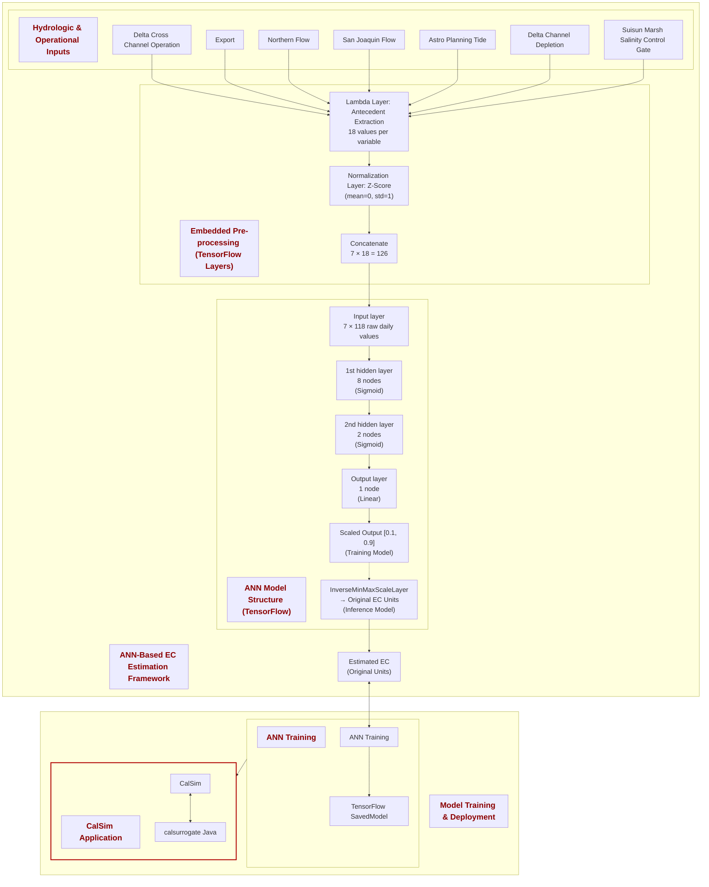

# EC_X2_Surrogate
This code has been written in Python, adapted from an ANN model originally developed in Matlab. A comprehensive version of this code has been developed by Nicky Sandhu is available on GitHub (https://github.com/dwr-psandhu/ann_calsim). This updated version fully embeds all preprocessing and scaling operations directly into TensorFlow models using custom layers. The trained models can be exported in .pb format, enabling seamless integration and utilization in other programming environments, including Java within Eclipse. The reference study for the original model: Jayasundara, N. C., Seneviratne, S. A., Reyes, E., & Chung, F. I. (2020). Artificial neural network for Sacramento–San Joaquin Delta flow–salinity relationship for CalSim 3.0. Journal of Water Resources Planning and Management, 146(4), 04020015. To run and test the code, first, establish the necessary environment by executing "conda env create -f environment.yml" in your Conda prompt. Once set up, you can execute train_EC.ipynb or train_X2.ipynb using Jupyter Notebook.

## Key Features of the Current Implementation

### Fully Embedded Preprocessing Pipeline
- **Raw Input Processing**: Models accept raw daily time series (118 days × 7 predictors for EC, 118 days × 3 predictors for X2)
- **Antecedent Feature Extraction**: TensorFlow Lambda layers automatically compute antecedent features (1 current day + 7 daily lags + 10 block averages = 18 features per predictor)
- **Z-Score Normalization**: TensorFlow Normalization layers standardize inputs (mean=0, std=1) adapted on training data
- **MinMax Scaling**: Custom MinMaxScaleLayer scales outputs to [0.1, 0.9] range during training
- **Inverse Scaling**: Custom InverseMinMaxScaleLayer automatically converts predictions back to original units during inference

### Dual-Model Architecture
1. **Training Model**: Outputs predictions in scaled space [0.1, 0.9] for stable training
2. **Inference Model**: Automatically created from training model by adding InverseMinMaxScaleLayer, outputs predictions in original units (EC or X2)

This design ensures that all preprocessing, normalization, and scaling operations are part of the TensorFlow graph, eliminating external dependencies and guaranteeing identical preprocessing between training and deployment.


## ANN-Based EC Estimation Framework (Diagram 1)



---

## ANN-Based X2 Estimation Framework (Diagram 2)

```mermaid
flowchart TB

%% =================================================
%% BOX 1: ANN-Based X2 Estimation Framework
%% =================================================
subgraph BOTTOM[" "]
  direction TB
  BOTTOM_T["ANN-Based X2 Estimation Framework"]:::title

  subgraph HYDRO[" "]
    direction LR
    HYDRO_T["Hydrologic & Operational Inputs"]:::title

    X1["NDOI"]:::node
    X2["Suisun Marsh Salinity Control Gate"]:::node
    X3["Astro Planning Tide"]:::node
  end

  subgraph PRE[" "]
    direction TB
    PRE_T["Embedded Pre-processing (TensorFlow Layers)"]:::title

    HIST["Lambda Layer: Antecedent Extraction<br/>18 values per variable"]:::node
    NORM["Normalization Layer: Z-Score<br/>(mean=0, std=1)"]:::node
    FLAT["Concatenate<br/>3 × 18 = 54"]:::node
    HIST --> NORM --> FLAT
  end

  subgraph NET[" "]
    direction TB
    NET_T["ANN Model Structure (TensorFlow)"]:::title

    IN["Input layer<br/>3 × 118 raw daily values"]:::node
    H1["1st hidden layer<br/>8 nodes<br/>(Sigmoid)"]:::node
    H2["2nd hidden layer<br/>2 nodes<br/>(Sigmoid)"]:::node
    OUT["Output layer<br/>1 node<br/>(Linear)"]:::node
    SCALE["Scaled Output [0.1, 0.9]<br/>(Training Model)"]:::node
    INVSCALE["InverseMinMaxScaleLayer<br/>→ Original X2 Units<br/>(Inference Model)"]:::node
    IN --> H1 --> H2 --> OUT
    OUT --> SCALE
    SCALE -.-> INVSCALE
  end

  X1 --> HIST
  INVSCALE--> HIST
  X3 --> HIST
      

  FLAT --> IN
  OUT --> EC
end

%% =================================================
%% BOX 2: Model Training & Deployment
%% =================================================
subgraph TOP[" "]
  direction LR
  TOP_T["Model Training & Deployment"]:::title

  subgraph ANNTRAIN[" "]
    direction TB
    ANNTRAIN_T["ANN Training"]:::title

    CAS["ANN Training"]:::node
    TF["TensorFlow SavedModel"]:::node
    CAS --> TF
  end

  subgraph CALSIM_BOX[" "]
    direction TB
    CALSIM_T["CalSim Application"]:::title

    CS["CalSim"]:::node
    SURR["calsurrogate Java"]:::node
    CS <--> SURR
  end

  ANNTRAIN --> CALSIM_BOX:::invis
end

EC <--> CAS

classDef node font-size:22px;
classDef title font-size:26px,font-weight:bold,color:#8b0000;
classDef invis stroke:transparent,fill:transparent,color:transparent;

style CALSIM_BOX stroke:#b00000,stroke-width:3px;

