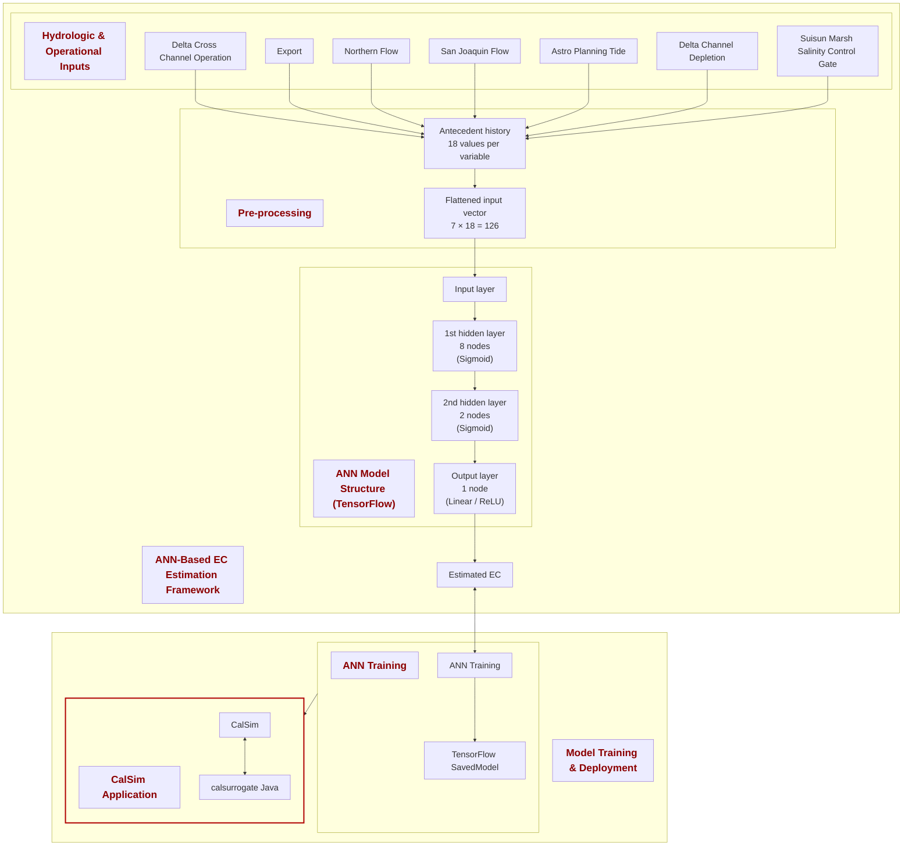

# EC_X2_Surrogate
This code has been written in Python, adapted from an ANN model originally developed in Matlab. A comprehensive version of this code has been developed by Nicky Sandhu is available on GitHub (https://github.com/dwr-psandhu/ann_calsim). This updated version is based on preprocessed input data and incorporates the normalization process directly into the model building phase utilizing the TensorFlow library. As a result, the trained model can be exported in .pb format, enabling seamless integration and utilization in other programming environments, including Java within Eclipse. The reference study for the original model: Jayasundara, N. C., Seneviratne, S. A., Reyes, E., & Chung, F. I. (2020). Artificial neural network for Sacramento–San Joaquin Delta flow–salinity relationship for CalSim 3.0. Journal of Water Resources Planning and Management, 146(4), 04020015. To run and test the code, first, establish the necessary environment by executing "conda env create -f environment.yml" in your Conda prompt. Once set up, you can execute train.ipynb using Jupyter Notebook.

## ANN-Based EC Estimation Framework (Diagram 1)



---

## ANN-Based X2 Estimation Framework (Diagram 2)

```mermaid
flowchart TB

%% =================================================
%% BOX 1: ANN-Based X2 Estimation Framework
%% =================================================
subgraph BOTTOM[" "]
  direction TB
  BOTTOM_T["ANN-Based X2 Estimation Framework"]:::title

  subgraph HYDRO[" "]
    direction LR
    HYDRO_T["Hydrologic & Operational Inputs"]:::title

    X1["NDOI"]:::node
    X2["Suisun Marsh Salinity Control Gate"]:::node
    X3["Astro Planning Tide"]:::node
  end

  subgraph PRE[" "]
    direction TB
    PRE_T["Pre-processing"]:::title

    HIST["Antecedent history<br/>18 values per variable"]:::node
    FLAT["Flattened input vector<br/>3 × 18 = 54"]:::node
    HIST --> FLAT
  end

  subgraph NET[" "]
    direction TB
    NET_T["ANN Model Structure (TensorFlow)"]:::title

    IN["Input layer<br/>54 nodes"]:::node
    H1["1st hidden layer<br/>8 nodes<br/>(Sigmoid)"]:::node
    H2["2nd hidden layer<br/>2 nodes<br/>(Sigmoid)"]:::node
    OUT["Output layer<br/>1 node<br/>(Linear / ReLU)"]:::node
    IN --> H1 --> H2 --> OUT
  end

  X1 --> HIST
  X2 --> HIST
  X3 --> HIST
      

  FLAT --> IN
  OUT --> EC
end

%% =================================================
%% BOX 2: Model Training & Deployment
%% =================================================
subgraph TOP[" "]
  direction LR
  TOP_T["Model Training & Deployment"]:::title

  subgraph ANNTRAIN[" "]
    direction TB
    ANNTRAIN_T["ANN Training"]:::title

    CAS["ANN Training"]:::node
    TF["TensorFlow SavedModel"]:::node
    CAS --> TF
  end

  subgraph CALSIM_BOX[" "]
    direction TB
    CALSIM_T["CalSim Application"]:::title

    CS["CalSim"]:::node
    SURR["calsurrogate Java"]:::node
    CS <--> SURR
  end

  ANNTRAIN --> CALSIM_BOX:::invis
end

EC <--> CAS

classDef node font-size:22px;
classDef title font-size:26px,font-weight:bold,color:#8b0000;
classDef invis stroke:transparent,fill:transparent,color:transparent;

style CALSIM_BOX stroke:#b00000,stroke-width:3px;

