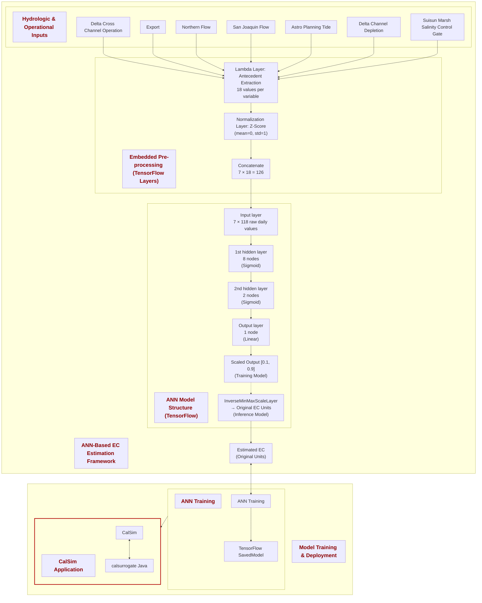

# EC_X2_Surrogate
This code has been written in Python, adapted from an ANN model originally developed in Matlab. A comprehensive version of this code has been developed by Nicky Sandhu is available on GitHub (https://github.com/dwr-psandhu/ann_calsim). This updated version fully embeds all preprocessing and scaling operations directly into TensorFlow models using custom layers. The trained models can be exported in .pb format, enabling seamless integration and utilization in other programming environments, including Java within Eclipse. The reference study for the original model: Jayasundara, N. C., Seneviratne, S. A., Reyes, E., & Chung, F. I. (2020). Artificial neural network for Sacramento–San Joaquin Delta flow–salinity relationship for CalSim 3.0. Journal of Water Resources Planning and Management, 146(4), 04020015. To run and test the code, first, establish the necessary environment by executing "conda env create -f environment.yml" in your Conda prompt. Once set up, you can execute train_EC.ipynb or train_X2.ipynb using Jupyter Notebook.

## Key Features of the Current Implementation

### Fully Embedded Preprocessing Pipeline
- **Raw Input Processing**: Models accept raw daily time series (118 days × 7 predictors for EC, 118 days × 3 predictors for X2)
- **Antecedent Feature Extraction**: TensorFlow Lambda layers automatically compute antecedent features (1 current day + 7 daily lags + 10 block averages = 18 features per predictor)
- **Z-Score Normalization**: TensorFlow Normalization layers standardize inputs (mean=0, std=1) adapted on training data
- **MinMax Scaling**: Custom MinMaxScaleLayer scales outputs to [0.1, 0.9] range during training
- **Inverse Scaling**: Custom InverseMinMaxScaleLayer automatically converts predictions back to original units during inference

### Dual-Model Architecture
1. **Training Model**: Outputs predictions in scaled space [0.1, 0.9] for stable training
2. **Inference Model**: Automatically created from training model by adding InverseMinMaxScaleLayer, outputs predictions in original units (EC or X2)

This design ensures that all preprocessing, normalization, and scaling operations are part of the TensorFlow graph, eliminating external dependencies and guaranteeing identical preprocessing between training and deployment.

## Training and Inference Pipeline based on 7 features

The following flowchart illustrates the complete end-to-end process from raw data to EC predictions, showing how preprocessing, training, and inference are integrated:

```mermaid
flowchart TB
    %% Data Loading
    START([Raw Daily Data CSV<br/>Date + 7 Predictors + EC Target]):::data
    LOAD[Load EC_inputs.csv<br/>Parse dates, sort chronologically]:::process
    
    %% Data Splitting
    SPLIT[Split by Date Ranges<br/>Train: 1940-2015<br/>Test: 1923-1939]:::process
    
    %% Window Creation
    WINDOW[Create 118-Day Sliding Windows<br/>For each day t:<br/>Input: days from t-117 to t<br/>Target: EC at day t]:::process
    
    %% Format Conversion
    FORMAT[Convert to 7-Input Format<br/>Each input: N × 118 array<br/>One per predictor variable]:::process
    
    %% Model Building - Preprocessing
    subgraph PREPROCESS[Embedded Preprocessing Layers - Built into Model]
        direction TB
        INPUT[7 Input Layers<br/>Each: 118 raw daily values]:::layer
        LAMBDA[Lambda Layers<br/>Extract 18 antecedents per input<br/>1 current + 7 daily + 10 blocks]:::layer
        ZNORM[Normalization Layers<br/>Z-score standardization<br/>mean=0, std=1<br/>Adapted on training data]:::layer
        CONCAT[Concatenate Layer<br/>Combine all features<br/>7 × 18 = 126 features]:::layer
        
        INPUT --> LAMBDA
        LAMBDA --> ZNORM
        ZNORM --> CONCAT
    end
    
    %% Neural Network
    subgraph NEURAL[Neural Network Architecture]
        direction TB
        HIDDEN1[Hidden Layer 1<br/>8 nodes, Sigmoid activation]:::layer
        HIDDEN2[Hidden Layer 2<br/>2 nodes, Sigmoid activation]:::layer
        OUTPUT[Output Layer<br/>1 node, Linear activation]:::layer
        
        HIDDEN1 --> HIDDEN2
        HIDDEN2 --> OUTPUT
    end
    
    %% Training Scaling
    SKLEARN[sklearn MinMaxScaler<br/>Scale targets to range 0.1 to 0.9<br/>For training stability]:::process
    
    TRAIN[Training Process<br/>Model learns to output<br/>scaled predictions in range 0.1 to 0.9<br/>Epochs: 1000, Patience: 1000]:::process
    
    TRAINED[Trained Model<br/>Outputs: Scaled in range 0.1 to 0.9]:::model
    
    %% Inference Model Creation
    INFERENCE_CREATE[Create Inference Model<br/>Add InverseMinMaxScaleLayer<br/>to trained model]:::process
    
    INFERENCE_MODEL[Inference Model<br/>Outputs: Original EC Units]:::model
    
    %% Prediction & Evaluation
    PREDICT[Make Predictions<br/>Training & Test Data]:::process
    
    EVAL[Model Evaluation<br/>• R² Score<br/>• RMSE<br/>• Scatter Plots<br/>• Time Series<br/>• Monthly Aggregations]:::process
    
    SAVE[Save Models<br/>• Training Model in .pb format<br/>• Inference Model in .pb format<br/>Ready for Java deployment]:::process
    
    FINAL([EC Predictions<br/>Original Units<br/>Ready for CalSim]):::data
    
    %% Flow connections
    START --> LOAD
    LOAD --> SPLIT
    SPLIT --> WINDOW
    WINDOW --> FORMAT
    FORMAT --> INPUT
    CONCAT --> HIDDEN1
    OUTPUT --> SKLEARN
    SKLEARN --> TRAIN
    TRAIN --> TRAINED
    TRAINED --> INFERENCE_CREATE
    INFERENCE_CREATE --> INFERENCE_MODEL
    INFERENCE_MODEL --> PREDICT
    PREDICT --> EVAL
    EVAL --> SAVE
    SAVE --> FINAL
    
    %% Styling
    classDef data fill:#e1f5ff,stroke:#0066cc,stroke-width:3px,color:#000
    classDef process fill:#fff4e6,stroke:#ff9800,stroke-width:2px,color:#000
    classDef layer fill:#f3e5f5,stroke:#9c27b0,stroke-width:2px,color:#000
    classDef model fill:#e8f5e9,stroke:#4caf50,stroke-width:3px,color:#000
    
    style PREPROCESS fill:#fce4ec,stroke:#c2185b,stroke-width:2px
    style NEURAL fill:#e3f2fd,stroke:#1976d2,stroke-width:2px
```



### Key Process Details

**1. Data Preparation:**
- Raw daily time series loaded from CSV
- Train/test split based on historical date ranges
- Sliding windows create sequences of 118 consecutive days
- Each sample represents history ending at prediction day t

**2. Embedded Preprocessing (in TensorFlow graph):**
- **Antecedent Extraction**: Converts 118 daily values → 18 features per variable
  - 1 current day value
  - 7 individual daily lags (t-1, t-2, ..., t-7)
  - 10 block averages covering remaining history
- **Z-Score Normalization**: Standardizes each feature using training data statistics
- **Feature Concatenation**: Combines 7 variables × 18 features = 126 total inputs

**3. Training:**
- Output targets scaled to [0.1, 0.9] using sklearn for numerical stability
- Model learns to predict in scaled space
- Early stopping prevents overfitting

**4. Inference:**
- Inference model created by adding inverse scaling layer
- Automatically converts [0.1, 0.9] → original EC units
- All preprocessing embedded, no external dependencies needed

**5. Deployment:**
- Saved as TensorFlow SavedModel (.pb format)
- Can be loaded and executed in Java via calsurrogate
- Identical preprocessing guaranteed between training and production


## ANN-Based EC Estimation Framework (Diagram 1) based on 126 inputs (preprocessed)



---

## ANN-Based X2 Estimation Framework (Diagram 2) based on 54 inputs (preprocessed)

```mermaid
flowchart TB

%% =================================================
%% BOX 1: ANN-Based X2 Estimation Framework
%% =================================================
subgraph BOTTOM[" "]
  direction TB
  BOTTOM_T["ANN-Based X2 Estimation Framework"]:::title

  subgraph HYDRO[" "]
    direction LR
    HYDRO_T["Hydrologic & Operational Inputs"]:::title

    X1["NDOI"]:::node
    X2["Suisun Marsh Salinity Control Gate"]:::node
    X3["Astro Planning Tide"]:::node
  end

  subgraph PRE[" "]
    direction TB
    PRE_T["Embedded Pre-processing (TensorFlow Layers)"]:::title

    HIST["Lambda Layer: Antecedent Extraction<br/>18 values per variable"]:::node
    NORM["Normalization Layer: Z-Score<br/>(mean=0, std=1)"]:::node
    FLAT["Concatenate<br/>3 × 18 = 54"]:::node
    HIST --> NORM --> FLAT
  end

  subgraph NET[" "]
    direction TB
    NET_T["ANN Model Structure (TensorFlow)"]:::title

    IN["Input layer<br/>3 × 118 raw daily values"]:::node
    H1["1st hidden layer<br/>8 nodes<br/>(Sigmoid)"]:::node
    H2["2nd hidden layer<br/>2 nodes<br/>(Sigmoid)"]:::node
    OUT["Output layer<br/>1 node<br/>(Linear)"]:::node
    SCALE["Scaled Output [0.1, 0.9]<br/>(Training Model)"]:::node
    INVSCALE["InverseMinMaxScaleLayer<br/>→ Original X2 Units<br/>(Inference Model)"]:::node
    IN --> H1 --> H2 --> OUT
    OUT --> SCALE
    SCALE -.-> INVSCALE
  end

  X1 --> HIST
  INVSCALE--> HIST
  X3 --> HIST
      

  FLAT --> IN
  OUT --> EC
end

%% =================================================
%% BOX 2: Model Training & Deployment
%% =================================================
subgraph TOP[" "]
  direction LR
  TOP_T["Model Training & Deployment"]:::title

  subgraph ANNTRAIN[" "]
    direction TB
    ANNTRAIN_T["ANN Training"]:::title

    CAS["ANN Training"]:::node
    TF["TensorFlow SavedModel"]:::node
    CAS --> TF
  end

  subgraph CALSIM_BOX[" "]
    direction TB
    CALSIM_T["CalSim Application"]:::title

    CS["CalSim"]:::node
    SURR["calsurrogate Java"]:::node
    CS <--> SURR
  end

  ANNTRAIN --> CALSIM_BOX:::invis
end

EC <--> CAS

classDef node font-size:22px;
classDef title font-size:26px,font-weight:bold,color:#8b0000;
classDef invis stroke:transparent,fill:transparent,color:transparent;

style CALSIM_BOX stroke:#b00000,stroke-width:3px;

